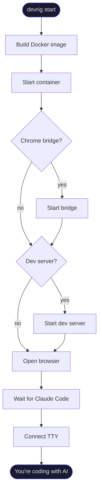

[](https://github.com/fuho/devrig/actions/workflows/ci.yml) [](https://npmjs.com/package/devrig) [](LICENSE) [](https://nodejs.org)

# devrig

**Run AI coding agents in Docker so they can't break your machine.**

AI agents install packages, modify system files, run arbitrary commands. devrig gives them a containerized playground with your project mounted, optional browser control, and git safety rails. Two commands to start, zero runtime dependencies.

## Why devrig?

- **Isolation** — the AI runs in a Docker container. Your host system stays untouched.
- **Git safety** — `git push` is blocked inside the container. `git pull` on master is blocked. The AI can commit freely but can't ship broken code.
- **Browser control** — the AI can see and interact with your running app through Chrome, not just edit files blind.
- **Zero config** — `npx devrig init` scaffolds everything. No Dockerfiles to write, no compose files to maintain.
- **Clean host** — no global packages, no Claude Code installation on your machine, no leftover processes after sessions end.
- **Reproducible** — commit `.devrig/` to your repo and your whole team gets the same containerized setup.

## How It Works



<details>
<summary>ASCII version (for terminals)</summary>

```
┌─────────────────────────────────────────────────────────────┐
│                        Host machine                         │
│                                                             │
│   devrig CLI ──────────────────────────────────────────┐   │
│                                                         │   │
│   Chrome (browser) ◄── chrome bridge (port 9229)       │   │
│                                                         │   │
│   Dev server (npm run dev, port 3000)                   │   │
│                                                         │   │
│   ┌─────────────────────────────────────────────────┐  │   │
│   │               Docker container                  │  │   │
│   │                                                 │  │   │
│   │   /workspace  (your project, bind-mounted)      │  │   │
│   │                                                 │  │   │
│   │   Claude Code ◄──────────────────────────────── ┼──┘   │
│   │                                                 │      │
│   │   tools: git, ripgrep, gh, pnpm, jq, vim...    │      │
│   └─────────────────────────────────────────────────┘      │
└─────────────────────────────────────────────────────────────┘
```

</details>

## Quick Start

```bash
# Scaffold .devrig/ in your project directory
npx devrig init

# Build the container and start a session
npx devrig start
```

Here's what `devrig start` looks like:

```
[devrig] Building Docker image (files changed)...
 => [dev 1/6] FROM node:25-slim
 => ...
[devrig] Build complete.
[devrig] Chrome bridge started on port 9229
[devrig] Starting dev server: npm run dev
[devrig] Dev server ready at http://localhost:3000
[devrig] Opening browser...
[devrig] Waiting for Claude Code to be ready in container...
  [container] Installing Claude Code (native)...
  [container] Claude Code v1.x.x installed
  [container] Setup complete
[devrig] Claude Code is ready.
[devrig] Connecting to Claude Code in container...
```

From here you're inside Claude Code with your project at `/workspace`. When you're done, Ctrl+C or type `/exit` — devrig cleans up everything automatically.

## CLI

| Command                | Description                                                |
| ---------------------- | ---------------------------------------------------------- |
| `devrig init`          | Scaffold `.devrig/` directory and run configuration wizard |
| `devrig start [flags]` | Start a coding session (alias: `devrig claude`)            |
| `devrig stop`          | Stop a running session from another terminal               |
| `devrig status`        | Show whether container, bridge, and dev server are running |
| `devrig config`        | Re-run the configuration wizard                            |

### Flags for `start`

| Flag              | Effect                                                |
| ----------------- | ----------------------------------------------------- |
| `--rebuild`       | Force rebuild the Docker image                        |
| `--no-chrome`     | Skip Chrome bridge and browser                        |
| `--no-dev-server` | Skip the dev server                                   |
| `--npm`           | Use npm-based Claude Code installer instead of native |

## Configuration

### devrig.toml

```toml
tool = "claude"          # AI tool (currently only "claude")
project = "my-project"   # Docker image and container name

[dev_server]
command = "npm run dev"  # Command to start your dev server
port = 3000              # Port the dev server listens on
ready_timeout = 10       # Seconds to wait for the server to respond

[chrome_bridge]
port = 9229              # Chrome debugging protocol port

# [claude]
# ready_timeout = 120    # Seconds to wait for Claude Code to install
```

Remove a section to disable that feature.

<details>
<summary>Full configuration reference</summary>

| Field           | Section           | Default            | Description                               |
| --------------- | ----------------- | ------------------ | ----------------------------------------- |
| `tool`          | top-level         | `"claude"`         | AI tool to use (future: codex, open-code) |
| `project`       | top-level         | `"claude-project"` | Docker image/container name               |
| `command`       | `[dev_server]`    | _(none)_           | Shell command to start your dev server    |
| `port`          | `[dev_server]`    | `3000`             | Port the dev server listens on            |
| `ready_timeout` | `[dev_server]`    | `10`               | Seconds to wait for dev server readiness  |
| `port`          | `[chrome_bridge]` | `9229`             | Chrome debugging protocol port            |
| `ready_timeout` | `[claude]`        | `120`              | Seconds to wait for Claude Code setup     |

</details>

### .env

Set per-session environment variables. Managed by `devrig config`.

```bash
CLAUDE_PARAMS=--dangerously-skip-permissions
GIT_AUTHOR_NAME=Your Name
GIT_AUTHOR_EMAIL=you@example.com
```

<details>
<summary>SSH &amp; Git setup</summary>

`.devrig/home/` is mounted as `/home/dev` inside the container — so anything you put there is available to the AI agent as its home directory.

> [!TIP]
> Copy your SSH config and key into `.devrig/home/.ssh/`:
>
> ```
> Host github.com
>     HostName github.com
>     User git
>     IdentityFile ~/.ssh/id_ed25519
>     IdentitiesOnly yes
> ```
>
> Copy the config to `.devrig/home/.ssh/config` and your key to `.devrig/home/.ssh/`.

Use a passwordless key — passphrase-protected keys won't work inside the container without an ssh-agent relay.

> [!WARNING]
> `.devrig/home/` is gitignored by default. Your SSH keys will never be accidentally committed to version control.

</details>

### Session Management

- `devrig stop` tears down a running session from another terminal — stops the container, bridge, and dev server.
- `devrig status` shows the current state of each component.
- If a session crashes, the next `devrig start` detects the stale lock and recovers automatically.

## What's Inside the Container

<details>
<summary>Container details</summary>

| Aspect          | Details                                                                  |
| --------------- | ------------------------------------------------------------------------ |
| **Base image**  | `node:25-slim`                                                           |
| **Tools**       | git, ripgrep, gh, socat, vim, tree, pnpm, curl, jq                       |
| **User**        | `dev` with UID matching your host (no permission issues on Linux)        |
| **Git safety**  | `git push` blocked, `git pull` on master blocked                         |
| **Resources**   | 8 GB memory, 4 CPUs (edit compose files to change)                       |
| **Claude Code** | Installed automatically on first start (native or npm)                   |
| **Volumes**     | Project at `/workspace`, node_modules persisted, home dir at `/home/dev` |

</details>

## Prerequisites

> [!IMPORTANT]
>
> - Node.js >= 18.3
> - Docker Desktop (or Docker Engine + Compose plugin)

## Development

| Command                 | What it does                   |
| ----------------------- | ------------------------------ |
| `npm test`              | Unit + integration tests       |
| `npm run test:coverage` | Tests with V8 coverage report  |
| `npm run lint`          | ESLint                         |
| `npm run format:check`  | Prettier check                 |
| `npm run typecheck`     | TypeScript JSDoc type checking |
| `npm run check`         | All of the above, sequentially |

<details>
<summary>Project structure</summary>

```
bin/
  devrig.js          CLI entry point
src/
  launcher.js        Main orchestrator (build, start, connect)
  config.js          TOML parser, config loading
  session.js         Session lock, stop, status, staleness
  cleanup.js         Process termination, Docker teardown
  docker.js          Compose commands, build hash, rebuild detection
  configure.js       Interactive configuration wizard
  browser.js         Platform-aware Chrome launcher
  bridge-host.cjs    TCP-to-Unix relay for Chrome bridge
  init.js            Scaffold copying, gitignore management
  log.js             Logging helpers
scaffold/
  Dockerfile         Container image (native installer)
  Dockerfile.npm     Container image (npm installer)
  compose.yml        Docker Compose for native variant
  compose.npm.yml    Docker Compose for npm variant
  entrypoint.sh      Container entrypoint
  container-setup.js Runs inside container — installs Claude Code, sets up bridge
  template/          Starter files for new projects
test/
  *.test.js          Node built-in test runner, no external deps
```

</details>

## Acknowledgments

The Chrome browser bridge is based on [claude-code-remote-chrome](https://github.com/vaclavpavek/claude-code-remote-chrome) by [Vaclav Pavek](https://github.com/vaclavpavek).

## License

[MIT](LICENSE)
