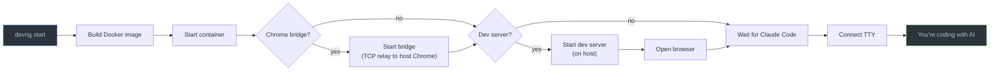

# README & CHANGELOG Redesign Implementation Plan

> **For agentic workers:** REQUIRED SUB-SKILL: Use superpowers:subagent-driven-development (recommended) or superpowers:executing-plans to implement this plan task-by-task. Steps use checkbox (`- [ ]`) syntax for tracking.

**Goal:** Rewrite README.md to be engaging and scannable using GitHub markdown features, and update CHANGELOG.md for the 0.2.0 release.

**Architecture:** Pure documentation changes — no code modifications. README gets a complete rewrite with Mermaid diagrams, collapsible sections, alert admonitions, badges, and tables. CHANGELOG gets a new 0.2.0 section.

**Tech Stack:** GitHub-Flavored Markdown, Mermaid

**Spec:** `docs/superpowers/specs/2026-04-03-readme-changelog-redesign.md`

---

### Task 1: Write README — Badges, Title, Hook, and Why Section

**Files:**

- Modify: `README.md` (full rewrite — replace all content)

- [ ] **Step 1: Write the top section of README.md**

Replace the entire contents of `README.md` with:

```markdown
[](https://github.com/fuho/devrig/actions/workflows/ci.yml)
[](https://www.npmjs.com/package/devrig)
[](LICENSE)
[](https://nodejs.org/)

# devrig

Run AI coding agents in Docker so they can't break your machine.

AI coding agents are powerful — they install packages, modify system files, and run arbitrary commands on your behalf. That's great until something goes wrong. devrig gives them a containerized playground with your project mounted, optional browser control, and git safety rails. Two commands to start, zero runtime dependencies.

## Why devrig?

- **Isolation** — the AI runs in a Docker container. Your host system stays untouched.
- **Git safety** — `git push` is blocked inside the container. `git pull` on master is blocked. The AI can commit freely but can't ship broken code.
- **Browser control** — the AI can see and interact with your running app through Chrome, not just edit files blind.
- **Zero config** — `npx devrig init` scaffolds everything. No Dockerfiles to write, no compose files to maintain.
- **Clean host** — no global packages, no Claude Code installation on your machine, no leftover processes after sessions end.
- **Reproducible** — commit `.devrig/` to your repo and your whole team gets the same containerized setup.
```

- [ ] **Step 2: Verify rendering**

Run: `npx prettier --check README.md`
Expected: File passes formatting check (or fix with `--write`)

- [ ] **Step 3: Commit**

```bash
git add README.md
git commit -m "docs: rewrite README — badges, hook, why section"
```

---

### Task 2: Write README — How It Works (Mermaid + ASCII)

**Files:**

- Modify: `README.md` (append after Why section)

- [ ] **Step 1: Append the How It Works section**

Add after the "Why devrig?" section:

````markdown
## How It Works



<details>
<summary>ASCII version (for terminals)</summary>

```
  Host machine                          Docker container
 +-----------------------------------------+-----------------------------------+
 |                                         |                                   |
 |  devrig start                           |   /workspace (your project)       |
 |    |                                    |   Claude Code (auto-installed)    |
 |    +-- build image (if needed)          |   git (push blocked)             |
 |    +-- start container ----------------->   node, ripgrep, gh, vim, pnpm   |
 |    +-- start chrome bridge --------+    |                                   |
 |    +-- start dev server            |    +-----------------------------------+
 |    +-- wait for Claude ready       |
 |    +-- connect TTY (you're in)     |
 |                                    |
 |  Chrome <---- TCP relay -----------+
 |  localhost:3000 (dev server)
 |
 +-----------------------------------------+
```

</details>
````

- [ ] **Step 2: Commit**

```bash
git add README.md
git commit -m "docs: add architecture diagram (Mermaid + ASCII fallback)"
```

---

### Task 3: Write README — Quick Start with Sample Output

**Files:**

- Modify: `README.md` (append after How It Works)

- [ ] **Step 1: Append the Quick Start section**

Add after the How It Works section:

````markdown
## Quick Start

```bash
npx devrig init     # scaffold .devrig/, walk through config
npx devrig start    # build, start services, connect
```

Here's what `devrig start` looks like:

```
[devrig] Building Docker image (files changed)...
 => [dev 1/6] FROM node:25-slim
 => ...
[devrig] Build complete.
[devrig] Chrome bridge started on port 9229
[devrig] Starting dev server: npm run dev
[devrig] Dev server ready at http://localhost:3000
[devrig] Opening browser...
[devrig] Waiting for Claude Code to be ready in container...
  [container] Installing Claude Code (native)...
  [container] Claude Code v1.x.x installed
  [container] Setup complete
[devrig] Claude Code is ready.
[devrig] Connecting to Claude Code in container...
```

From here you're inside Claude Code with your project at `/workspace`. When you're done, Ctrl+C or type `/exit` — devrig cleans up everything automatically.
````

- [ ] **Step 2: Commit**

```bash
git add README.md
git commit -m "docs: add Quick Start with sample output"
```

---

### Task 4: Write README — CLI Reference Tables

**Files:**

- Modify: `README.md` (append after Quick Start)

- [ ] **Step 1: Append the CLI section**

Add after the Quick Start section:

```markdown
## CLI

| Command                | Description                                                |
| ---------------------- | ---------------------------------------------------------- |
| `devrig init`          | Scaffold `.devrig/` directory and run configuration wizard |
| `devrig start [flags]` | Start a coding session (alias: `devrig claude`)            |
| `devrig stop`          | Stop a running session from another terminal               |
| `devrig status`        | Show whether container, bridge, and dev server are running |
| `devrig config`        | Re-run the configuration wizard                            |

### Flags for `start`

| Flag              | Effect                                                |
| ----------------- | ----------------------------------------------------- |
| `--rebuild`       | Force rebuild the Docker image                        |
| `--no-chrome`     | Skip Chrome bridge and browser                        |
| `--no-dev-server` | Skip the dev server                                   |
| `--npm`           | Use npm-based Claude Code installer instead of native |
```

- [ ] **Step 2: Commit**

```bash
git add README.md
git commit -m "docs: add CLI reference tables"
```

---

### Task 5: Write README — Configuration (toml, env, SSH, sessions)

**Files:**

- Modify: `README.md` (append after CLI)

- [ ] **Step 1: Append the Configuration section**

Add after the CLI section:

````markdown
## Configuration

### devrig.toml

Created by `devrig init` or `devrig config`. Remove a section to disable that feature.

```toml
tool = "claude"          # AI tool (currently only "claude")
project = "my-project"   # Docker image and container name

[dev_server]
command = "npm run dev"  # Command to start your dev server
port = 3000              # Port the dev server listens on
ready_timeout = 10       # Seconds to wait for the server to respond

[chrome_bridge]
port = 9229              # Chrome debugging protocol port

# [claude]
# ready_timeout = 120    # Seconds to wait for Claude Code to install
```

<details>
<summary>Full configuration reference</summary>

| Field           | Section           | Default            | Description                               |
| --------------- | ----------------- | ------------------ | ----------------------------------------- |
| `tool`          | top-level         | `"claude"`         | AI tool to use (future: codex, open-code) |
| `project`       | top-level         | `"claude-project"` | Docker image/container name               |
| `command`       | `[dev_server]`    | _(none)_           | Shell command to start your dev server    |
| `port`          | `[dev_server]`    | `3000`             | Port the dev server listens on            |
| `ready_timeout` | `[dev_server]`    | `10`               | Seconds to wait for dev server readiness  |
| `port`          | `[chrome_bridge]` | `9229`             | Chrome debugging protocol port            |
| `ready_timeout` | `[claude]`        | `120`              | Seconds to wait for Claude Code setup     |

</details>

### .env

Set per-session environment variables. Managed by `devrig config`.

```bash
CLAUDE_PARAMS=--dangerously-skip-permissions
GIT_AUTHOR_NAME=Your Name
GIT_AUTHOR_EMAIL=you@example.com
```

<details>
<summary>SSH & Git setup</summary>

devrig mounts `.devrig/home/` as `/home/dev` inside the container. To use SSH-based git operations (clone private repos, push to forks), place your keys and config here.

> [!TIP]
> Create `.devrig/home/.ssh/config` with your GitHub SSH settings:
>
> ```
> Host github.com
>     HostName github.com
>     User git
>     IdentityFile ~/.ssh/id_ed25519
>     IdentitiesOnly yes
> ```
>
> Then copy your key: `cp ~/.ssh/id_ed25519 .devrig/home/.ssh/`

Use a **passwordless** SSH key or one managed by `ssh-agent` on your host. Passphrase-protected keys won't work inside the container since there's no agent forwarding.

> [!WARNING]
> `.devrig/home/` is gitignored by default — your keys stay out of version control. Don't remove this gitignore entry.

</details>

### Session Management

Only one devrig session can run per project at a time. A lock file (`.devrig/session.json`) tracks the active session.

- **`devrig stop`** tears down a running session from another terminal — stops the container, bridge, and dev server
- **`devrig status`** shows whether each component is running or stopped
- If a session crashes (e.g. `kill -9`), the next `devrig start` detects the stale lock and recovers automatically
````

- [ ] **Step 2: Commit**

```bash
git add README.md
git commit -m "docs: add configuration, SSH setup, and session management"
```

---

### Task 6: Write README — Container Details, Prerequisites, Development, Footer

**Files:**

- Modify: `README.md` (append remaining sections)

- [ ] **Step 1: Append the remaining sections**

Add after the Configuration section:

````markdown
## What's Inside the Container

<details>
<summary>Container details</summary>

| Aspect          | Details                                                                  |
| --------------- | ------------------------------------------------------------------------ |
| **Base image**  | `node:25-slim`                                                           |
| **Tools**       | git, ripgrep, gh, socat, vim, tree, pnpm, curl, jq                       |
| **User**        | `dev` with UID matching your host (no permission issues on Linux)        |
| **Git safety**  | `git push` blocked, `git pull` on master blocked                         |
| **Resources**   | 8 GB memory, 4 CPUs (edit compose files to change)                       |
| **Claude Code** | Installed automatically on first start (native or npm)                   |
| **Volumes**     | Project at `/workspace`, node_modules persisted, home dir at `/home/dev` |

</details>

> [!IMPORTANT]
> **Prerequisites:**
>
> - **Node.js >= 18.3** — [download](https://nodejs.org/)
> - **Docker Desktop** (or Docker Engine + Compose plugin) — [download](https://www.docker.com/products/docker-desktop/)

## Development

| Command                 | What it does                   |
| ----------------------- | ------------------------------ |
| `npm test`              | Unit + integration tests       |
| `npm run test:coverage` | Tests with V8 coverage report  |
| `npm run lint`          | ESLint                         |
| `npm run format:check`  | Prettier check                 |
| `npm run typecheck`     | TypeScript JSDoc type checking |
| `npm run check`         | All of the above, sequentially |

<details>
<summary>Project structure</summary>

```
bin/
  devrig.js          CLI entry point
src/
  launcher.js        Main orchestrator (build, start, connect)
  config.js          TOML parser, config loading
  session.js         Session lock, stop, status, staleness
  cleanup.js         Process termination, Docker teardown
  docker.js          Compose commands, build hash, rebuild detection
  configure.js       Interactive configuration wizard
  browser.js         Platform-aware Chrome launcher
  bridge-host.cjs    TCP-to-Unix relay for Chrome bridge
  init.js            Scaffold copying, gitignore management
  log.js             Logging helpers
scaffold/
  Dockerfile         Container image (native installer)
  Dockerfile.npm     Container image (npm installer)
  compose.yml        Docker Compose for native variant
  compose.npm.yml    Docker Compose for npm variant
  entrypoint.sh      Container entrypoint
  container-setup.js Runs inside container — installs Claude Code, sets up bridge
  template/          Starter files for new projects
test/
  *.test.js          Node built-in test runner, no external deps
```

</details>

## Acknowledgments

The Chrome browser bridge is based on [claude-code-remote-chrome](https://github.com/vaclavpavek/claude-code-remote-chrome) by [Vaclav Pavek](https://github.com/vaclavpavek).

## License

[MIT](LICENSE)
````

- [ ] **Step 2: Run format check**

Run: `npx prettier --write README.md`

- [ ] **Step 3: Commit**

```bash
git add README.md
git commit -m "docs: add container details, prerequisites, development, footer"
```

---

### Task 7: Update CHANGELOG for 0.2.0

**Files:**

- Modify: `CHANGELOG.md`

- [ ] **Step 1: Add 0.2.0 section at the top of CHANGELOG.md**

Insert before the existing `## 0.1.0` section:

```markdown
## 0.2.0 — 2026-04-03

### Features

- `devrig stop` — stop a running session from another terminal
- `devrig status` — show running components and their state
- Session lock — prevents parallel sessions on the same project with PID-based lock file
- Scaffold staleness warning — alerts when `.devrig/` files are from an older version
- Error hardening — user-friendly messages for file I/O failures in `devrig init`

### Development

- ESLint 9 with flat config and eslint-config-prettier
- Prettier formatting (2-space indent, single quotes, trailing commas)
- TypeScript JSDoc type checking via `tsc --checkJs`
- Test coverage via Node's built-in `--experimental-test-coverage`
- GitHub Actions CI across Node 18, 20, and 22
- JSDoc on all exported functions
- `npm run check` runs lint + format + typecheck + test in one command

### Documentation

- README rewritten with Mermaid architecture diagram, GitHub alerts, collapsible sections, badges
- SSH & Git setup guide for containerized workflows
- Expanded CLI and configuration reference tables
```

- [ ] **Step 2: Commit**

```bash
git add CHANGELOG.md
git commit -m "docs: add CHANGELOG entry for 0.2.0"
```

---

### Task 8: Bump version to 0.2.0

**Files:**

- Modify: `package.json`

- [ ] **Step 1: Update version field in package.json**

Change `"version": "0.1.0"` to `"version": "0.2.0"`.

- [ ] **Step 2: Run checks to make sure nothing broke**

Run: `npm run check`
Expected: lint clean, format clean, typecheck clean, 47/47 tests pass

- [ ] **Step 3: Commit**

```bash
git add package.json
git commit -m "chore: bump version to 0.2.0"
```

---

### Task 9: Final review

- [ ] **Step 1: Verify README renders correctly**

Run: `npx prettier --check README.md CHANGELOG.md`
Expected: All files pass

- [ ] **Step 2: Verify all checks still pass**

Run: `npm run check`
Expected: lint clean, format clean, typecheck clean, 47/47 tests pass

- [ ] **Step 3: Spot-check README content against bin/devrig.js**

Read `bin/devrig.js` and verify:

- All commands listed in README CLI table exist in the switch statement
- All flags listed in README match `parseArgs` options in `src/launcher.js`
- Badge URLs point to correct repo (`fuho/devrig`)
